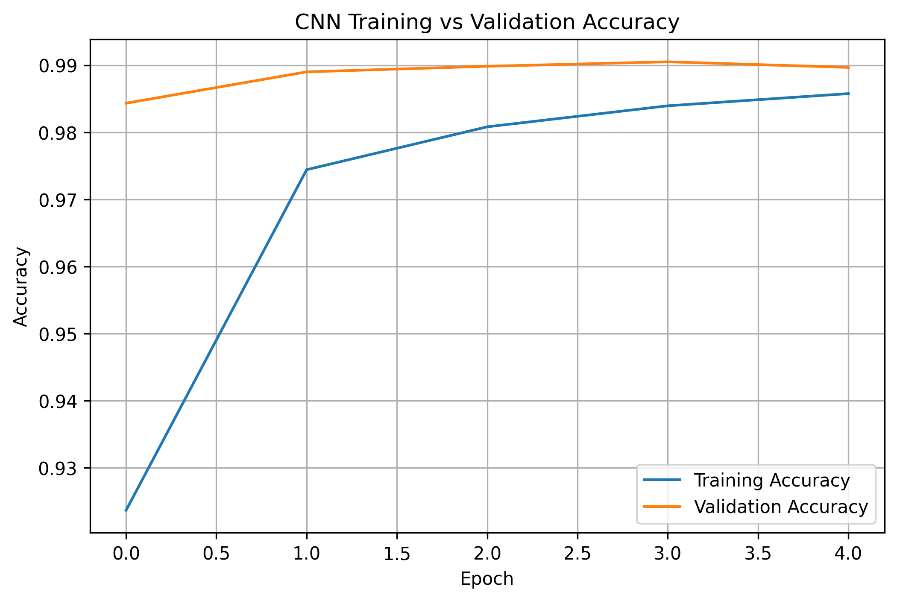
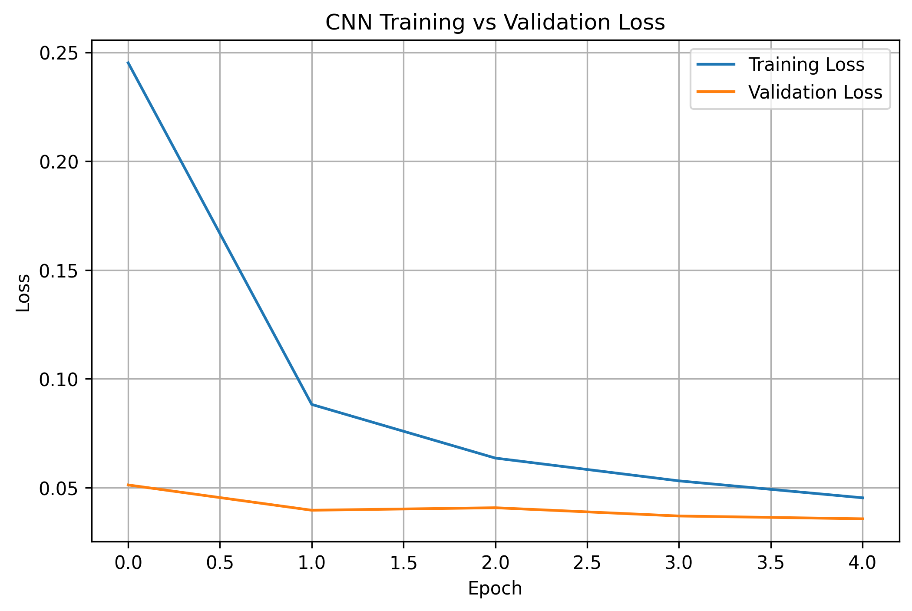
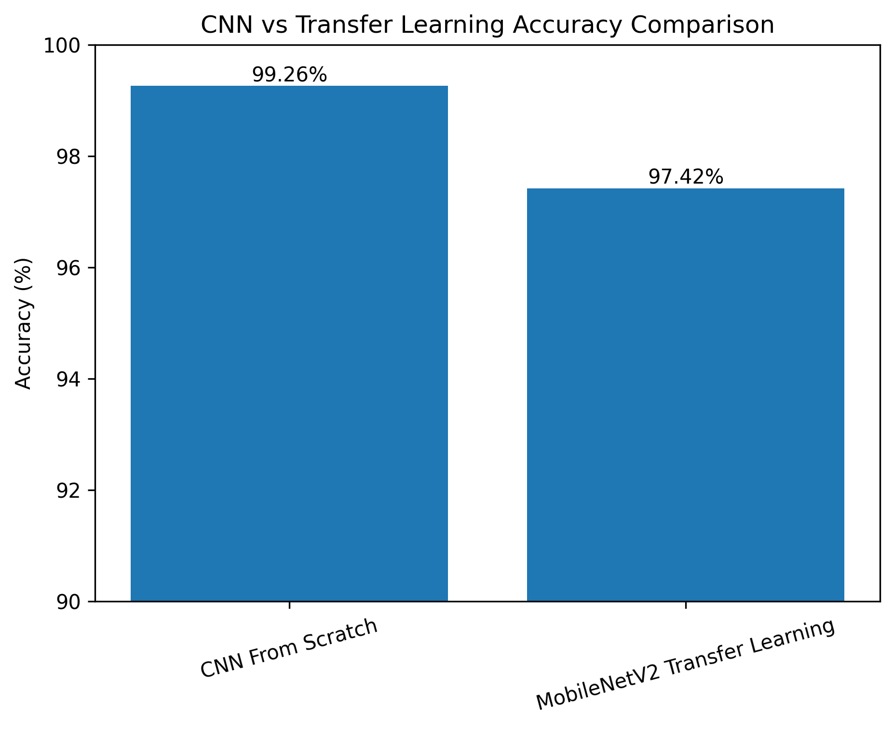

# CNN vs MobileNetV2: Handwritten Digit Classification

## 📌 Project Overview

This project compares two deep learning approaches for handwritten digit classification using the MNIST dataset.

The first model is a Convolutional Neural Network (CNN) built from scratch, while the second model uses Transfer Learning with MobileNetV2. The objective is to compare the performance of a custom CNN against a pretrained deep learning model adapted for handwritten digit recognition.

---

## 🚀 Features

- Handwritten digit classification (0–9)
- CNN developed from scratch
- Transfer Learning using MobileNetV2
- Model performance comparison
- Training and Validation accuracy visualization
- Training and Validation loss visualization
- Prediction on unseen test images
- Saved trained models

---

## 📂 Dataset

**Dataset:** MNIST Handwritten Digits

- 60,000 Training Images
- 10,000 Testing Images
- Image Size: 28 × 28
- Grayscale Images
- 10 Classes (Digits 0–9)

---

## 🧠 Models Used

### CNN From Scratch

- Convolution Layers
- MaxPooling Layers
- Dense Layers
- Dropout
- Softmax Output Layer

### MobileNetV2 (Transfer Learning)

- Pretrained MobileNetV2
- Custom Classification Head
- Fine-tuned for MNIST digit classification

---

## 🛠️ Technologies Used

- Python
- TensorFlow
- Keras
- NumPy
- Matplotlib
- Pandas
- Google Colab

---

## 📊 Results

| Model | Test Accuracy | Test Loss |
|--------|--------------:|----------:|
| CNN From Scratch | **99.26%** | **0.0254** |
| MobileNetV2 Transfer Learning | **97.42%** | **0.0860** |

---

## 📈 Performance Visualizations

### CNN Training vs Validation Accuracy



---

### CNN Training vs Validation Loss



---

### CNN vs MobileNetV2 Accuracy Comparison



---

## 📁 Repository Structure

```text
├── CNN_Transfer_Learning_Image_Classification.ipynb
├── CNN_MNIST_Model.keras
├── MobileNetV2_MNIST_Model.keras
├── cnn_accuracy_curve.png
├── cnn_loss_curve.png
└── model_comparison.png
```

---

## ▶️ How to Run

1. Clone the repository.
2. Install the required Python libraries.
3. Open the Jupyter Notebook or Google Colab notebook.
4. Run all cells sequentially.
5. Evaluate both models and compare their performance.

---

## 🎯 Future Improvements

- Train on more challenging datasets such as CIFAR-10 or Fashion-MNIST.
- Perform hyperparameter tuning.
- Fine-tune more layers of MobileNetV2.
- Deploy the model using Streamlit or Flask.
- Compare additional pretrained CNN architectures.

---

## 👩‍💻 Author

**Ekta Belwanshi**

Computer Science Engineering Student

Interested in Artificial Intelligence, Machine Learning and Deep Learning.

---

## ⭐ If you found this project helpful, consider giving it a star!
